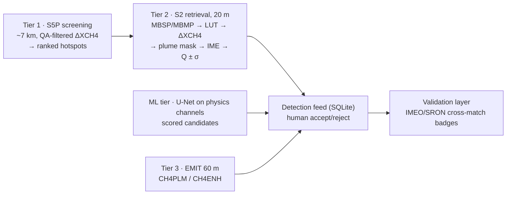
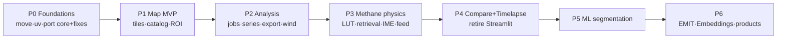

<!-- docs/plan.md — the v2 master plan, approved 2026-07-04/05.
     Architecture decisions in here are SETTLED; sessions should implement
     within them, not re-litigate them. Live phase status: docs/roadmap.md.
     Phase 0 (Foundations) COMPLETE — merged to main 2026-07-05.
     Phase 1 (Map platform MVP) COMPLETE — branch v2/phase1-map-mvp, 2026-07-05.
     Phase 2 (Analysis backbone) COMPLETE — branch v2/phase2-analysis, 2026-07-05. -->

# OpenEarth v2 — Complete Overhaul Plan

## Context

OpenEarth Explorer began as "easily display all publicly available satellite data" and grew into a ~8,770-line Streamlit app (134 commits, Feb–Apr 2026): Explorer mode (S5P/S2/S1 + ERA5 wind), a Kayrros-inspired Methane Detection mode, daily time series, and statistics. It works, but it has hit three walls:

1. **Structural**: `app/tabs/spatial_map.py` is 2,246 lines (~25% of the codebase); Streamlit reruns every tab on every interaction; two inconsistent cache tiers (`st.cache_data(ttl=3600)` everywhere in `app/analysis.py` + ad-hoc `session_state` caches like `_anomaly_scale`; the README's advertised "LRU analysis cache" doesn't exist in the code); a compare tab was built and abandoned; temporal animation does a full rerun per frame.
2. **Scientific**: the methane products are proxies, not retrievals — "MBSP" is a raw `(B12−B11)/B11` with no per-scene calibration, the anomaly is an uncalibrated mean-of-ratios difference on TOA reflectance, there is no plume masking or emission quantification, S5P gets no QA filtering, and the ERA5 wind is noon-averaged (not overpass-matched) with a direction-convention bug. The user never trusted the methane map — correctly.
3. **Ambition**: the goal is a professional production-grade personal product, not a neater rewrite.

**This plan is a full redesign**: Python core library + FastAPI backend + React/TypeScript/MapLibre GL frontend, a scientifically defensible methane suite (physics retrieval + ML segmentation + EMIT), a timelapse studio, and new capabilities (embedding similarity search, dataset catalog, split compare, polygon ROIs).

## Decisions (locked with user, 2026-07-04)

| Decision | Choice |
|---|---|
| Stack | Full rebuild: FastAPI backend + React/TS/MapLibre GL frontend; Python core library remains the heart |
| Methane scope | All three: physics retrieval done right (Varon-style MBSP/MBMP + IME quantification), ML plume segmentation, EMIT hyperspectral tier |
| Deployment | Purely personal, local-first; Docker-ready for possible later deployment; GEE per-user OAuth stays |
| Packaging | uv workspace (NOTE: the uv switch the user remembers never landed — repo is still pip+setuptools, `requirements.txt` + `pyproject.toml` with setuptools backend, `requires-python >= 3.10`; do it now) |
| Repo home | Move out of OneDrive → `~/Projects/openearth`; private GitHub repo becomes backup/sync (confirmed 2026-07-04 — OneDrive/git conflicts already observed) |

## Code audit — every defect claim re-verified against the repo (2026-07-04)

| Claim | Verified location | Status |
|---|---|---|
| `spatial_map.py` 2,246 lines; codebase ~8.8k lines; 134 commits | `wc -l`, `git log` | ✓ exact |
| ERA5 wind: `atan2(u,v)` = blowing-toward azimuth, comment claims "meteorological"; fixed noon±12h window, not overpass-matched | `gee_era5.py:74-79` (direction), `gee_era5.py:29-34` (window) | ✓ |
| `CH4_ANOMALY` registry entry carries vestigial `expression="B12 / B11"` → generic render path silently shows the wrong product | `s2_registry.py:804-834`, expression at `:808` | ✓ |
| s2cloudless join has no null-guard (`cloud_prob_img` may be absent) | `gee_s2.py:50-54` | ✓ |
| Single-scene anomaly: `.filter(...).first()` with no missing-scene guard | `gee_s2.py:324-333` | ✓ |
| `daily_timeseries`: sequential blocking `getInfo` per batch, no retry/backoff/concurrency | `daily_timeseries.py:98-117` (eager fetches), `:208` (per-batch loop) | ✓ |
| Cache keys: unrounded bbox floats → spurious misses; `st.cache_data` args are the keys | `app/analysis.py` (14× `@st.cache_data(ttl=3600)`) | ✓ |
| ROI presets + 7 CH4 sites + date hints | `app/config.py:17-93` (`ROI_EXAMPLES`), `:96-121` (`CH4_DATE_HINTS`) | ✓ |
| S2 indices on L1C TOA (`_to_reflectance` divides DN by 10 000 on L1C) while only RGB uses L2A | `gee_s2.py:57-62` + collection ids | ✓ |

**Correction to the draft**: the "dead files" (`src/openearth/visualization/no2_heatmap.py`, stale `__pycache__`/egg-info, the `providers 17-39-30-617/` conflict dir) are **not in git** — they are OneDrive-local artifacts on the user's machine. In git the only true dead file is `src/__init__.py` (wrong for src-layout, 1 line). Consequence for Phase 0: do the move as a **fresh clone from GitHub into `~/Projects/openearth`** (artifacts stay behind in the OneDrive copy, which is then archived/deleted), rather than `mv`-ing the OneDrive folder.

## Audit: what stays, what gets fixed, what goes

**Keep (port into v2 core):**
- Registry pattern (`GasConfig`/`S2IndexConfig`/`S1BandConfig` frozen dataclasses: band, palette, vis/valid ranges, display_scale, unit, description) — generalize into a unified dataset catalog
- Error taxonomy `src/openearth/errors.py` (`OpenEarthError` hierarchy, `classify_ee_error`, ROI/date validation)
- s2cloudless cloud masking (`gee_s2.py` join + probability threshold) — with null-guard added
- Vegetation/water masking module (`masking/vegetation_water.py`)
- ROI presets + methane sites with date hints (`app/config.py:17-121`: Korpezhe, Galkynysh, Permian Basin, Hassi Messaoud, Basra, Four Corners, Upper Silesia) → become seeded DB rows
- Composite builders / thumbnail dimension math / GeoTIFF logic in `visualization/heatmap.py` (concepts, not folium code)
- The per-variable "Reading the scale" description strings (registry `description` fields)

**Fix (confirmed defects — see table above):**
- ERA5 wind convention + overpass matching (`gee_era5.py`)
- `CH4_ANOMALY` vestigial expression (`s2_registry.py:808`)
- S2 L1C-vs-L2A split → v2 standardizes on L2A `S2_SR_HARMONIZED` for indices/RGB; **TOA retained deliberately inside the methane retrieval only** (retrieval literature uses TOA), documented
- S5P: apply per-gas QA masking
- S1 "VV/VH ratio" is a dB difference; no orbit-pass filtering (ascending/descending mixes geometry) → rename honestly, add orbit filter option, optional temporal speckle reduction
- s2cloudless null-guard (`gee_s2.py:50-54`); single-scene anomaly missing-scene guard (`gee_s2.py:324-333`)
- `daily_timeseries`: concurrency + retry/backoff (superseded by timeseries v2)
- Cache keys: round bbox to 5 dp; one real cache tier (diskcache) replaces `st.cache_data` + session_state ad hoc

**Drop / retire:**
- Entire Streamlit layer (move to `legacy/`, keep runnable until the new app reaches parity end of Phase 4, then delete)
- folium/streamlit-folium/branca wind-arrow DivIcon macro (MapLibre replaces all)
- `src/__init__.py` (the one dead file actually in git); `run_openearth.command` updated or dropped
- OneDrive artifacts retire themselves via the fresh-clone move

## Verified external facts (checked 2026-07-04)

- **EMIT on GEE**: `NASA/EMIT/L2B/CH4PLM` (plume complexes, 60 m, outlines + uncertainty) and `NASA/EMIT/L2B/CH4ENH` (enhancement raster). GEE copy spans Aug 2022–Oct 2024; V1 decommissioned Mar 2026, V2 lives on NASA LP DAAC → design GEE-first with `earthaccess` fallback for recent granules.
- **AlphaEarth embeddings**: `GOOGLE/SATELLITE_EMBEDDING/V1/ANNUAL` — 64-dim vectors, 10 m, annual 2017–2025. Enables similarity search / change detection / clustering entirely server-side in EE.
- **ML training data**: CH4Net (Vaughan et al. 2024, AMT 17:2583) — 925 hand-annotated Sentinel-2 plume masks over 23 super-emitter sites 2017–2020, Zenodo record 8267966, github.com/anna-allen/CH4Net. Secondary: STARCOP (Růžička et al. 2023, Sci Rep) — AVIRIS-NG hyperspectral chips (~60 GB), Zenodo 7863343, relevant for the EMIT tier.
- **Validation**: SRON weekly TROPOMI plume maps; UNEP IMEO "Eye on Methane" portal (methanedata.unep.org; events public 30 days post-detection). No guaranteed stable API → build a manual-import adapter, not a live integration.
- **Method references**: Varon et al. 2021 (AMT 14:2771) for S2 MBSP/MBMP methane retrieval; Varon et al. 2018 for IME quantification Q = (U_eff/L)·IME.

## Methane science specification (the heart of the redesign)

Three-tier detection ladder, each tier feeding the next:



### Tier 1 — S5P regional screening (~7 km)
- `CH4_column_volume_mixing_ratio_dry_air_bias_corrected`, QA-filtered.
- Regional enhancement ΔXCH4 = scene − rolling spatial/temporal background (median over window); flag persistent hotspots above N·σ.
- Output: ranked hotspot list per watch region → candidate sites for Tier 2.

### Tier 2 — S2 point-source retrieval (20 m) — replaces current proxies
All physics in NumPy on `computePixels` chips (L1C TOA B11/B12 + per-scene sun/view zenith from metadata):
1. **Calibrated MBSP**: ΔR = c·(R12/R11) − 1 with c from least-squares regression over ROI pixels (c = Σ R11·R12 / Σ R12²), **iterated once**: fit → exclude |ΔR| > 1σ pixels → refit, so the plume can't bias its own calibration. This is the calibration the current `(B12−B11)/B11` lacks.
2. **MBMP** (default method): ΔR_MBMP = ΔR_MBSP(target) − ΔR_MBSP(reference) — cancels persistent surface structure. Reference auto-selected by `scenes.py` (nearest cloud-free acquisition, same relative orbit preferred), user-overridable.
3. **ΔR → ΔXCH4 conversion (real physics, offline LUT)**: `scripts/generate_ch4_lut.py` pulls CH4 absorption cross-sections via HAPI/HITRAN, convolves with published S2A/S2B B11+B12 spectral response functions, and integrates two-path band transmittance T_band(ΔΩ, AMF) on a grid (ΔΩ ∈ [0,2] mol/m², AMF = 1/cosθ_sun + 1/cosθ_view ∈ [2,4]). Committed as `ch4_lut_v1.npz` with provenance. Runtime: build the forward model m_MBMP(ΔΩ) = T_B12/T_B11 − 1 at the scene's AMF, invert observed ΔR by monotonic 1-D interpolation; ΔXCH4[ppb] = ΔΩ/Ω_air × 1e9. Bias (no scattering) documented; checked against digitized Varon 2021 curves (unit test) and EMIT CH4ENH on coincident scenes (Phase 6). Fallback if the LUT work stalls: digitized literature curves, with ΔR shown as the honest unit until then.
4. **Plume masking** (`methane/plume.py`, NumPy): background σ via median absolute deviation from a plume-free region → threshold at k·σ (default 2, exposed) → `scipy.ndimage.label` 8-connectivity → min-area filter (default 5 px) → optional 1-px binary opening (salt noise) → keep component(s) intersecting the suspected source / max-enhancement pixel.
5. **IME quantification**: IME = Σ_mask ΔΩ·A_pix·M_CH4 (kg); L = √(mask area); U_eff = linear calibration vs U10 with coefficients transcribed from Varon et al. 2021 for S2/MBMP (Varon 2018 log form as alternative), cited in `constants.py`; Q = (U_eff/L)·IME in kg/h. **Uncertainty: Monte Carlo (n=500)** jointly sampling wind speed (ERA5 temporal variance around overpass + calibration σ), retrieval noise (background σ resampled onto the mask), mask threshold jitter (k ∈ [1.5, 2.5]), and U_eff coefficient σ → median Q, ±1σ, percentiles stored on the Detection.
6. **Wind done right** (`methane/wind.py`): read the scene's actual `system:time_start`, sample the two bracketing ERA5-Land hourly grids, time-interpolate, average over the ROI; return BOTH `wind_to_deg = atan2(u,v)` and `wind_from_deg = wind_to + 180°`, explicitly named (fixes `gee_era5.py:74-79`), with cardinal-case unit tests (u=1,v=0 ⇒ from=270°, to=90°). Global-ERA5 fallback over water.
7. **False-positive suppression**: NDVI/NDWI/urban masks (ported), cloud+shadow masks, multi-band consistency checks; UI always shows RGB + reference-scene context beside retrievals.

### Tier 3 — EMIT confirmation (60 m, hyperspectral)
- Overlay `CH4PLM` plume polygons + `CH4ENH` enhancement raster for the site/date range; `earthaccess` fetcher for post-Oct-2024 V2 granules.
- Cross-validation: does an S2 detection coincide with an EMIT plume complex? Auto-annotate detections.

### ML tier — plume segmentation (runs beside physics, not instead)
- **Data reality**: CH4Net ships 925 hand-annotated masks + scene IDs over **23 sites** (mostly Turkmenistan O&G, 2017–2020) — the **imagery must be rebuilt from GEE** via `scripts/export_ch4net_chips.py` (computePixels, resumable, rate-limited; ~an afternoon of exports). Small and geographically narrow ⇒ **site-held-out cross-validation (~5 folds grouped by site)** is mandatory; random splits would leak surface texture and inflate scores.
- **Model**: `smp.Unet(encoder="resnet18", in_channels=5)`; input channels `[MBMP ΔR, MBSP ΔR, target/reference B12/B11 ratio, B12, B11]` — physics-informed channels are the right call for a small dataset; ablate against CH4Net's raw-band baseline to prove it. Dice+BCE loss; augmentation flips/rot90 ONLY (no color jitter on physical channels).
- **Metrics**: pixel IoU/F1 **plus scene-level detection precision/recall and false positives per plume-free scene**, always reported beside the physics σ-threshold baseline on identical inputs.
- **Training**: PyTorch on the M2 (MPS, fp32, batch 8–16 — ~1–2k chips means epochs are minutes); Colab fallback documented. PyTorch over JAX for the segmentation ecosystem (smp pretrained encoders, ONNX path).
- **Serving**: ONNX export with torch-vs-onnxruntime parity test; the API depends on `onnxruntime` only, never torch. `POST /api/methane/ml/scan` produces scored candidate Detections (`source="ml"`) into the same feed as physics detections.
- **Framing**: the model is a **candidate ranker feeding the human-review detection feed, never an autonomous detector**; physics/ML disagreements are flagged (great validation signal, and a clean writeup for the ML Essentials lecture). Accepted/rejected review decisions accumulate as future fine-tuning data.

### Validation & honesty layer
- Importer for IMEO/SRON event lists (CSV/GeoJSON) → match detections by location/date → per-detection verdict badges (confirmed / plausible / unvalidated / contradicted).
- Every methane product carries a methodology note + limitations (surface type, wind uncertainty, detection floor ~1–5 t/h for S2 under good conditions).

## Architecture

### Earth Engine ground rules (design defensively around these assumptions)

| Mechanic | Assumption | Defensive design |
|---|---|---|
| `getMapId` tile URLs | valid ~4 h (undocumented) | API returns `expires_at`; frontend re-mints at 75% TTL and on tile-error bursts via `source.setTiles()` |
| Concurrent requests | ~40/user across tiles + compute | one global semaphore (8 compute workers) in `ee/client.py` |
| `getInfo` latency | 0.5–5 s, occasional 429/5xx | tenacity retry + backoff + jitter, classified via the ported error taxonomy |
| `computePixels` | ≤ ~48 MB/response | self-limit 1024×1024 px × ≤6 float32 bands; tile + assemble locally |
| `getThumbURL` | practical ~2048 px/side | keep the cosine-corrected dimension math from `heatmap.py` |
| `getDownloadURL` | small areas only | fast path for small GeoTIFFs; large ones assembled from `computePixels` tiles via rasterio |

### Monorepo layout (uv workspace)

```
openearth/                    # NEW HOME: ~/Projects/openearth — FRESH CLONE from GitHub (Phase 0 step 1);
│                             #   OneDrive copy archived, its local-only artifacts left behind
├── pyproject.toml            # workspace root: [tool.uv.workspace] members=["packages/*"], exclude=["legacy"]
├── uv.lock                   # single lockfile for all workspace members
├── .python-version           # 3.13 (cp313 wheels cover torch/onnxruntime/rasterio; 3.14 still spotty)
├── .env.example              # OPENEARTH_* settings template
├── compose.yaml              # api + web; deploy-later artifact, built in CI to stay honest
├── Makefile                  # dev / test / lint / lut / seed shortcuts
├── packages/
│   ├── core/                 # dist "openearth-core", import openearth — pure science lib (NO web deps)
│   ├── api/                  # dist "openearth-api", import openearth_api — FastAPI (core + fastapi,
│   │                         #   uvicorn, sqlmodel, diskcache, sse-starlette, onnxruntime — NEVER torch)
│   └── ml/                   # dist "openearth-ml", import openearth_ml — training (torch, smp; not an api dep)
├── apps/web/                 # Vite + React + TS + MapLibre GL (pnpm)
├── legacy/                   # old Streamlit app (git mv of app/ + src/), NOT a workspace member: own pyproject
│                             #   + old pins, run via `uv run --project legacy streamlit run app/main.py`;
│                             #   deleted end of Phase 4
├── scripts/
│   ├── generate_ch4_lut.py   # HITRAN/HAPI → band-averaged CH4 absorption LUT (.npz, committed with provenance)
│   ├── export_ch4net_chips.py# rebuild CH4Net imagery from GEE scene IDs (resumable, rate-limited)
│   ├── seed_db.py            # ROI presets + CH4_DATE_HINTS (app/config.py:17-121) → sites/presets tables
│   └── dev.sh                # uvicorn --reload + vite dev together
├── data/                     # gitignored: cache/, openearth.db, models/, exports/
├── docs/                     # architecture.md, methane_methods.md (physics writeup), datasets.md, roadmap.md
└── .github/workflows/ci.yml
```

### Core library module map (`packages/core/src/openearth/`)

Guiding split: **Earth Engine for browsing and bulk reduction; NumPy for physics.** Everything science-critical runs on plain arrays so it is unit-testable offline.

```
errors.py        ported taxonomy + classify_ee_error + validators (src/openearth/errors.py); add RetrievalError, JobError
settings.py      pydantic-settings (OPENEARTH_ prefix): EE project, data dir, cache size, LUT path
geometry.py      ROI model: bbox OR polygon GeoJSON; area math + validation (extends validate_roi_bbox)
ee/              client.py (init/auth-check; ee_call() = global semaphore + tenacity retry + error classification),
                 render.py (image → tile URL / thumbnail / download URL — port of visualization/heatmap.py),
                 pixels.py (computePixels wrapper: grid math, 1024² tiling, ndarray out, size guards)
catalog/         models.py (frozen DatasetSpec/BandSpec/ProductSpec/VizSpec — generalizes the three registries),
                 registry.py, transforms.py (NAMED, string-referenceable: "s2cloudless", "to_db", "orbit_filter"…),
                 builtin/ (port all ~40 current entries: 6 gases, 18 indices, 13 raw bands, RGB, S1 bands),
                 loader.py (user datasets from TOML — THE "any public GEE collection, zero code changes" hook),
                 presets.py (ROI presets)
providers/       base.py (Provider protocol), generic.py (any TOML dataset via transforms),
                 s2.py (FIX: L2A SR for indices/RGB, L1C TOA only inside methane retrieval; s2cloudless + null-guards),
                 s1.py (FIX: orbit-pass/relativeOrbit filters, focal-median speckle option, honest dB naming),
                 s5p.py (per-gas QA, valid-range clamps), era5.py, emit.py (GEE ≤ Oct 2024 + earthaccess V2 fallback),
                 embeddings.py (similarity = dot product on unit-norm vectors, change = 1−dot, wekaKMeans clusters)
composites.py    mean/median/date-window/single-scene/latest (port from heatmap.py, de-folium'd)
masking.py       vegetation/water masks (port of masking/vegetation_water.py)
timeseries.py    v2 engine: server-side reduceRegion mapped over the collection, ONE getInfo per ~90-day chunk,
                 chunks in ThreadPoolExecutor(8) through the shared semaphore, explicit scale param so the UI
                 fires a coarse pass (4× native, near-instant) then refines; parquet-cached DataFrames
timelapse.py     date steps → composites → PNG frames (ee/render) → Pillow annotations → imageio-ffmpeg MP4/GIF/WebM
export.py        GeoTIFF via computePixels tiling + rasterio assembly (getDownloadURL fast path when small); PNG; CSV
analytics/       smoothing (port add_rolling_smooth; Savitzky–Golay for later phenology), stats, conversions
methane/         constants.py (literature coefficients WITH citations), models.py (Retrieval/PlumeMask/
                 EmissionEstimate/Detection dataclasses), scenes.py (scene search + reference selection),
                 retrieval.py (B11/B12 chips via computePixels → MBSP/MBMP in numpy),
                 conversion.py (ΔR→ΔΩ→ΔXCH4 via LUT; data/ch4_lut_v1.npz committed),
                 plume.py (masking on arrays), ime.py (Q ± Monte-Carlo σ), wind.py (overpass-matched ERA5),
                 tropomi.py (QA'd S5P context), emit.py (plumes → Detections), validation.py (IMEO/SRON matching),
                 detect.py (orchestrator: site+date → scenes → retrieval → mask → IME → Detection; ML hook point)
inference/       onnxruntime wrapper for the plume-segmentation model
```

Plume masking runs **client-side in NumPy** on fetched retrieval chips (a 5×5 km site @ 20 m is only 250×250 px ≈ 1 MB via `computePixels`): full control, unit-testable with synthetic plumes, and EE's server-side connected-components tooling caps object sizes and can't do iterative threshold/refit loops. Server-side EE keeps only an uncalibrated **"quicklook" MBSP tile layer** for browsing large areas on the map.

### FastAPI backend (`packages/api/`)

Endpoints (all under `/api`):

| Route | Purpose |
|---|---|
| `GET /catalog`, `GET /catalog/{id}` | dataset catalog + products + vis metadata |
| `POST /catalog/custom` (+`DELETE`) | register any GEE dataset from TOML/JSON → persisted to `data/catalog.d/` |
| `POST /tiles` | `{dataset, product, roi?, dates, composite, viz_overrides?}` → `{tile_url, expires_at, legend}` — **direct GEE XYZ URLs, no proxy** |
| `POST /thumbnail` | same body + width → PNG stream (diskcached) |
| `POST /timeseries` → job; `GET /timeseries/{job}/result?format=json\|csv\|parquet` | progressive daily series |
| `GET /methane/sites` CRUD | watchlist (seeded from the 7 presets + date hints) |
| `GET /methane/scenes?site&dates` | S2 scenes w/ cloud %, orbit, reference-usability flag |
| `POST /methane/analyze` | `{site\|roi, target_scene, reference_scene?\|auto, method, mask_params?}` → job → Detection |
| `GET/PATCH /methane/detections…` + `/{id}/retrieval.png` + `/array.npz` | feed CRUD (accept/reject/notes); georeferenced ΔXCH4 overlay for MapLibre image source |
| `POST /methane/validation/import`, `POST /methane/detections/{id}/validate` | IMEO CSV / SRON list import; cross-match |
| `GET /emit/plumes?bbox&dates`, `POST /emit/enhancement/tiles` | plume GeoJSON (`source: gee\|lpdaac`); CH4ENH tiles |
| `POST /timelapse` → job; `GET /timelapse/{job}/frames/{i}.png`, `/download` | render queue; frames double as the animation player payload |
| `GET /wind?lat&lon&time`, `GET /wind/field?bbox&time&nx&ny` | overpass-matched point sample / grid (arrows + particle texture) |
| `POST /embeddings/{similarity\|change\|cluster}` | AlphaEarth ops (server-side; similarity = dot product on unit-norm vectors) |
| `GET/POST/DELETE /aois`, `/workspaces`, `GET /presets/rois` | saved geometries, layer stacks, presets |
| `GET /jobs/{id}`, `GET /jobs/{id}/events` (SSE), `DELETE /jobs/{id}` | status / progress stream / cancel |
| `POST /export/{geotiff\|png}` → job | exports (works for every product, incl. methane layers — fixes the old gap) |
| `GET /health`, `GET /config` | version; settings summary + EE auth status (auth itself stays `earthengine authenticate` in a terminal) |

Design choices:
- **Direct GEE tile URLs, no proxy**: a proxy adds a hop and an event-loop hot path for zero benefit at personal scale. Expiry is handled client-side: the mint response carries `expires_at`, the frontend re-mints at 75% TTL and on tile-error bursts, swapping via `source.setTiles()` (layer stays in place, no flicker).
- **Jobs**: in-process asyncio manager — `submit(kind, params) → job_id`, core fns run in `asyncio.to_thread` bounded by the EE semaphore; progress → in-memory pub/sub + persisted to the `jobs` table; SSE via `sse-starlette` (EventSource auto-reconnects). On startup, `running` rows → `interrupted`. No Redis/Celery: single-user, one uvicorn process, SQLite gives restart visibility and job history for free.
- **One cache tier**: `diskcache.Cache` at `data/cache/` (thread-safe, LRU, size-capped). **Key = sha256 of canonical JSON** `{op, dataset, product, roi rounded 5 dp, dates, composite, scale, params, ALGO_VERSION}` — `ALGO_VERSION` bumped when science changes (LUT version included for methane ops). TTL: none for closed historical date ranges (immutable), 6 h for open-ended queries. Tile URLs deliberately NOT cached (they expire); thumbnails/timeseries/retrieval arrays/frames are.
- **DB**: SQLite via SQLModel, migrations by `PRAGMA user_version` (Alembic is overkill). Tables: `sites`, `aois`, `workspaces`, `jobs`, `detections(source: physics|ml|emit, scene_id, ref_scene_id, mask_geojson, xch4_max_ppb, ime_kg, q_kg_hr, q_sigma, u10, wind_from_deg, params_json, status: candidate|accepted|rejected, validation_json, …)`, `reference_events(imeo|sron)`, `custom_datasets`.
- **Config**: pydantic-settings + `.env` (`OPENEARTH_EE_PROJECT` preserved).

### Frontend (`apps/web/`)

Vite + React + TypeScript (pnpm). State: **Zustand** (viewport, layer stack, ROI, animation transport, methane-lab selections) + **TanStack Query** (all server data; a `useJob(jobId)` hook pipes SSE progress into the query cache). Types generated from FastAPI's OpenAPI via `openapi-typescript` (`pnpm gen`). Charts: **ECharts** (canvas perf, `dataZoom` brush+zoom, uncertainty bands, dark theme).

**MapLibre integration: thin custom binding, not react-map-gl** — a small `MapContext` plus hooks (`useRasterLayer`, `useTerraDraw`, `useImageFrames`). Compare, 10 fps animation, deck.gl overlays, and draw plugins are all imperative; a declarative wrapper would be fought constantly, and animation must not round-trip React renders. `useRasterLayer` updates `raster-opacity` / `moveLayer` for opacity/order/toggle **without touching the source** (no refetch), and handles expiry re-mint via `getSource(id).setTiles([fresh])`.

```
src/
  api/          typed client + query hooks + sse.ts
  stores/       zustand stores
  map/          MapContext + hooks; CompareMap (@maplibre/maplibre-gl-compare); DrawControl (terra-draw —
                maintained MapLibre support, unlike mapbox-gl-draw); InspectorControl (click → value + mini series);
                WindOverlay (Phase 2: SVG/canvas arrow grid from /wind/field; polish: deck.gl MapboxOverlay
                + deck.gl-particle fed by a u/v-encoded PNG)
  features/
    explore/    map studio: CatalogBrowser, LayerPanel (opacity/order/toggle/legend), RoiToolbar (draw + presets),
                DateControl, ChartPanel (timeseries), ExportDialog, AnimationBar
    methane/    Methane Lab: SiteList, scan runner with live progress, DetectionFeed (cards: date, method,
                Q ± σ kg/h, status chips, source badge physics/ML/EMIT); DetectionDetail: ΔXCH4 image overlay +
                mask outline + wind arrow + scene picker + mask-param sliders (re-run) + MC histogram + ValidationPanel
    timelapse/  studio: settings form → JobProgress → inline frame-player preview → download
    embeddings/ year picker, click-to-seed similarity, A/B change layer, k-means painter + cluster legend
    settings/   EE status, cache stats/clear, custom-dataset TOML editor
```

Routes: `/` (explore), `/compare` (two synced maps + swipe — needs its own layout), `/timelapse`, `/methane` + `/methane/detections/:id`, `/embeddings`, `/settings`. Timeseries/stats are panels within Explore (they share the map context).

**Temporal animation done right, two modes**: interactive browsing stays on tile layers with a date slider (preloading ±N frames as hidden raster sources); *playback* uses the timelapse job's server-rendered PNG frames as a MapLibre `image` source — preload all frames as `HTMLImageElement`s, then a `requestAnimationFrame` transport swaps `source.updateImage({url})` per tick. Deterministic, zero tile churn, zero React re-render — the old full-rerun flicker is gone by construction.

### ML package (`packages/ml/`)

```
data/ch4net.py    Zenodo masks (record 8267966) + scene-ID manifest → chip dataset; imagery rebuilt via
                  scripts/export_ch4net_chips.py; data/channels.py REUSES openearth.methane.retrieval
datamodule.py     site-stratified splits, Dataset/DataLoader, flips/rot90 aug only
models.py         smp.Unet(encoder="resnet18", in_channels=5, classes=1)
train.py          typer CLI; config-driven runs (configs/*.toml); MPS/CPU; checkpoints; CSV+TensorBoard
evaluate.py       IoU/F1 + scene-level precision/recall vs physics baseline (openearth.methane.plume)
export.py         → ONNX (opset pinned) + torch-vs-onnxruntime parity test
```

## New headline features (beyond methane)

1. **Timelapse Studio** (original sub-idea, done properly): any dataset/product, any ROI, date range, per-frame compositing (single date / rolling window / monthly-quarterly median), fps, resolution, format (MP4/GIF/WebM), burned-in annotations (date stamp, colorbar, scale bar, attribution), render as background job with per-frame progress, gallery of past renders.
2. **Dataset catalog** (original vision "all public satellite data"): registries become data — curated built-ins (everything current) + "add any GEE dataset" via the public Earth Engine STAC catalog (id, bands, vis defaults auto-suggested from STAC summaries).
3. **Split-screen compare** (resurrects the abandoned compare tab): MapLibre swipe control — two layer stacks or two dates of the same product.
4. **Polygon ROIs** (bbox-only today): draw arbitrary polygons, saved/named AOIs in DB.
5. **Embeddings Explorer** (AlphaEarth): click a point → cosine-similarity heatmap ("find places like this"), year-vs-year embedding change detection, k-means landscape clustering — all server-side EE, no ML infra needed.
6. **Pixel inspector**: click map → value readout + mini time series popup for the active layer.
7. **Wind particle animation** (ERA5 u/v → flowing particle layer à la windy.com) — polish phase.
8. **Derived products** from the user's own deferred list, now easy in the new architecture (each is a catalog entry + a small compute fn): dNBR burn severity, S1+S2 flood mask, deforestation change, urban heat proxy (NDBI−NDVI), phenology SOS/EOS (Savitzky–Golay), soil-moisture & biomass proxies later.
9. **Time series v2**: concurrent batched reduction with retry/backoff, progressive coarse→fine loading (monthly preview instantly, daily fills in), persistent parquet cache, coverage-fraction QA — kills the "too slow for big ROIs" problem.
10. **Saved workspaces & shareable state**: named layer-stack + ROI + date configs in SQLite; URL-encoded app state.

## Tooling & quality baseline

- **uv workspace**: root `[tool.uv.workspace] members = ["packages/*"]`, `exclude = ["legacy"]`; internal deps via `[tool.uv.sources] openearth-core = { workspace = true }`; one `uv.lock`, single root `.venv`, `uv sync` = whole dev env; `uv lock --check` in CI. `.python-version` pinned **3.13** (`requires-python = ">=3.12,<3.14"`).
- **ruff** (lint + format; `select = ["E","F","I","UP","B","SIM","RUF","PT"]`, line length 100) and **mypy** (`strict = true`; `ignore_missing_imports` scoped to `ee.*`/`diskcache.*`/`hapi.*`; core must pass clean, api close, ml relaxed).
- **pytest** per package. Unit tests need **no EE** (the payoff of the numpy-physics split): catalog validation + TOML loader; LUT inversion round-trip + monotonicity + digitized-Varon tolerance check; MBSP regression recovering injected `c` on synthetic scenes; plume masking on synthetic Gaussian plumes; **IME end-to-end on a synthetic plume with known Q**; wind-convention cardinal cases; cache-key stability; job manager with fake jobs; API via `TestClient` with services faked behind the Provider protocols. Live EE tests: `@pytest.mark.ee`, skipped unless `OPENEARTH_EE_TESTS=1` + real auth (never in CI).
- **pre-commit**: ruff check+format, mypy (push stage), `uv lock --check`, eslint/prettier for web.
- **GitHub Actions** (`ci.yml`): python job (`uv sync`, ruff, mypy, `pytest -m "not ee"`), web job (pnpm, eslint, `tsc --noEmit`, vitest, `vite build`), docker build on tags only. No EE secrets in CI ever.
- **compose.yaml** (multi-stage uv image for api; node build → nginx for web, proxying `/api`) is the deploy-later artifact, built in CI to stay honest; daily dev is `scripts/dev.sh`.

## Phased roadmap

Each phase has a hard exit criterion; something is usable at the end of every phase; features not listed live in the backlog, not in scope. The Streamlit app dies exactly when the new app supersedes it (end of Phase 4), not before.



**Phase 0 — Foundations (M).**
Fresh-clone repo from GitHub to `~/Projects/openearth` (commit #1 there); archive the OneDrive copy (its local-only conflict artifacts — `no2_heatmap.py`, `providers 17-39-30-617/`, stale `__pycache__`/egg-info — stay behind); update or drop `run_openearth.command`. Monorepo restructure; uv workspace (single lock, `.python-version` 3.13); ruff/mypy/pytest/pre-commit/CI. Streamlit app (`app/` + `src/`) → `legacy/` as a self-contained NON-workspace project with its old pins (`uv run --project legacy streamlit run app/main.py`). Delete `src/__init__.py`; fix the README's phantom "LRU cache" claims. Port core into `packages/core` **with the audit fixes** (wind convention `gee_era5.py:74-79` + overpass matching, CH4_ANOMALY vestige `s2_registry.py:808`, S5P QA, S2 SR/TOA split, s2cloudless null-guard `gee_s2.py:50-54`, single-scene guard `gee_s2.py:324-333`, S1 orbit filters + honest naming) and unit tests for all pure logic.
*Exit: CI green; legacy app still launches; `pytest` green with zero EE calls; no Streamlit import anywhere under `packages/`.*

**Phase 1 — Map platform MVP (L).**
FastAPI (catalog/tiles/thumbnail/config, diskcache, settings) + React shell: MapLibre map, catalog browser, layer panel (opacity/order/toggle without refetch), terra-draw polygon + bbox ROI *(polygons are a new capability)*, ROI presets, date control, legends, tile re-mint on expiry.
*Exit: any registered dataset browsable with polygon ROI and layer controls; **a brand-new GEE dataset added via TOML with zero code changes** (original vision unlocked); tiles survive >4 h sessions.*

**Phase 2 — Analysis backbone (L).**
Job manager + SSE; timeseries v2 (chunked + concurrent + coarse→fine + parquet cache) with ECharts brush/zoom panel; stats cards; pixel inspector; exports (GeoTIFF/PNG/CSV) for every product *(fixes the old methane-mode export gap)*; wind endpoint + arrow overlay; saved workspaces.
*Exit: a 1-year S5P + S2-index series over a polygon streams progress and lands < 30 s warm; GeoTIFF opens georeferenced in QGIS.*

**Phase 3 — Methane Lab, physics (XL).**
LUT script + committed `ch4_lut_v1.npz`; calibrated MBSP/MBMP numpy retrieval; plume masking; IME + Monte-Carlo uncertainty; overpass-matched wind; S5P screening tier with QA; sites/detections DB (seeded with the 7 sites + date hints); Methane Lab UI v1 (scene picker, ΔXCH4 overlay, plume cards with Q ± σ, detection feed with accept/reject); IMEO/SRON validation importer + cross-match badges; `docs/methane_methods.md`.
*Exit: reproduce ≥2 documented super-emitter events (e.g. Korpezhe, Hassi Messaoud) with Q within ~±50% of published values and defensible σ; synthetic-plume test suite green; every detection persisted and reviewable.*

**Phase 4 — Compare + Timelapse → retire Streamlit (M).**
`maplibre-gl-compare` view *(the abandoned compare tab returns)*; frame-player animation *(flicker gone by construction)*; Timelapse Studio (any dataset/ROI/step/fps → MP4/GIF/WebM) + gallery; parity sweep of remaining Streamlit niceties.
*Exit: parity checklist ticked; **`legacy/` deleted in one commit**; README rewritten.*

**Phase 5 — ML segmentation (L).**
CH4Net masks + chip-rebuild pipeline (license verified first); U-Net training with site-held-out CV; eval vs physics baseline; ONNX export; `/methane/ml/scan`; scored ML candidates in the detection feed with human accept/reject; physics/ML disagreement flags.
*Exit: site-held-out scene-level F1 reported and ≥ physics baseline; ONNX inference < 1 s/chip in the API.*

**Phase 6 — EMIT + Embeddings + products v1 (M).**
EMIT provider (GEE-first, earthaccess fallback): plume overlay + detection cross-validation *(Tier 3 complete)*; Embeddings Explorer (similarity/change/clusters); wind particle layer; first derived products as catalog recipes (dNBR, urban heat, S1+S2 flood mask — the other deferred products documented in `docs/roadmap.md`); compose.yaml polish + deploy doc.
*Exit: EMIT plumes overlay a known event and cross-match a detection; similarity search returns a sensible map from a clicked seed; `docker compose up` serves the full app.*

## Risks & mitigations

| # | Risk | Mitigation |
|---|---|---|
| 1 | **OneDrive + git** — already caused conflict artifacts locally (stray `providers 17-39-30-617/`, resurrected files, duplicate commits); node_modules + SQLite WAL under sync would be worse | Phase 0 step 1: fresh clone to `~/Projects`, private GitHub = sync/backup (user-confirmed); OneDrive copy archived; exports the user wants in OneDrive go to an artifacts folder, never the repo |
| 2 | **Python 3.14 wheel gaps** (torch, onnxruntime, rasterio) | Pin **3.13** (`.python-version`, `requires-python <3.14`) — cp313 covers the stack; uv makes the later bump a one-line change |
| 3 | **GEE mapid/tile expiry (~4 h, undocumented)** breaks long map sessions | Mint endpoint returns `expires_at`; frontend re-mints at 75% TTL and on tile-error bursts via `setTiles()`; treated as an assumption to measure, not a fact |
| 4 | **GEE quotas/latency** (~40 concurrent, per-request compute caps, 429 storms) | All EE traffic through `ee/client.py`: semaphore (8), tenacity backoff + jitter on `classify_ee_error`, chunked timeseries, chip-size caps, diskcache so nothing computes twice |
| 5 | **ΔR→ΔXCH4 conversion fidelity** — band-averaged Beer–Lambert ignores scattering; SRF/geometry errors | Unit-test LUT against digitized Varon 2021 curves; cross-check vs EMIT CH4ENH on coincident scenes (Phase 6); LUT version in cache keys; display raw ΔR until conversion passes spot-checks; bias documented — quantification is honest-uncertainty, not compliance-grade |
| 6 | **S2 methane false positives are inherent** (surface heterogeneity, clouds — the science, not the code) | MBMP default + reference-scene QC + per-site background-σ tracking + human review loop; UI always shows RGB/reference context beside retrievals |
| 7 | **CH4Net rebuild + licensing** — masks are small but 925 scenes of imagery must be re-exported from GEE; license assumed CC-BY, verify | License check is Phase 5 step 1; resumable rate-limited chip exporter; site-held-out eval guards the dataset's geographic narrowness; physics baseline stays the reference so ML is additive, not load-bearing |
| 8 | **MPS training limits** on the M2 Air | resnet18 + 256 px chips + fp32 + batch 8–16 (small dataset ⇒ epochs are minutes); Colab fallback documented; ONNX serving decouples the API from training hardware |
| 9 | **Physical detection floor** — S2 can't see plumes below ~1–5 t/h under good conditions | Honesty layer: per-detection uncertainty, validation-first workflow, EMIT confirmation tier, documented limitations |
| 10 | **Scope creep** (10 deferred products × 3 methane tiers × new UI surface) | Hard phase gates; derived products must be TOML catalog recipes, not bespoke endpoints (**"one new dataset = zero new code"** rule); violations wait in `docs/roadmap.md` |
| 11 | **GEE terms** if ever publicly hosted | Fine for personal use; revisit licensing before any public deployment |

## Verification

- **Unit (no EE, run in CI)**: calibration regression recovers a known injected `c` on synthetic scenes (incl. the plume-exclusion refit); LUT inversion round-trips, is monotonic, and matches digitized Varon 2021 curves within tolerance; plume masking on synthetic Gaussian plumes recovers area/shape and rejects salt noise; **IME end-to-end on a synthetic plume with known Q** (round-trip within tolerance); wind conventions (u=1,v=0 ⇒ from=270°, to=90°, all four cardinals); catalog + TOML-loader validation; cache-key stability; job manager with fake jobs; API routes with faked services.
- **Integration (`@pytest.mark.ee`, local only, `OPENEARTH_EE_TESTS=1`)**: tile mint for a catalog dataset; tiny-bbox S2 composite over Heidelberg; S5P QA masking non-empty; one retrieval chip fetch; EMIT plume fetch for a known Permian-Basin date.
- **E2E (Playwright, driven during development via the Playwright MCP)**: draw polygon ROI → add NDVI layer → tiles render → timeseries streams progressively → export CSV; GeoTIFF opens georeferenced in QGIS; methane golden path: scripted Korpezhe scan reproduces a stored detection fixture.
- **Science validation (Phase 3 gate, extended in Phase 6)**: notebook comparing our Q estimates against IMEO/SRON-reported rates for ≥3 events (target ~±50%), plus EMIT CH4ENH cross-checks on coincident scenes; results and residuals documented in `docs/methane_methods.md`.
- **Per-phase exit criteria** as listed in the roadmap; the app is manually driven in a real browser at the end of every phase.
